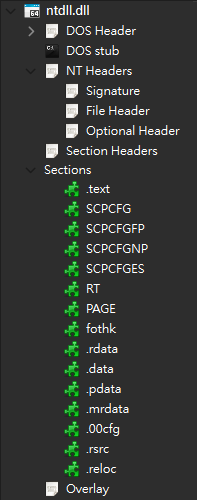
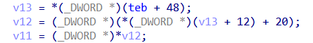
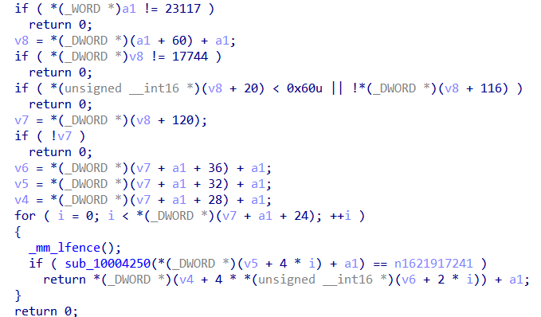
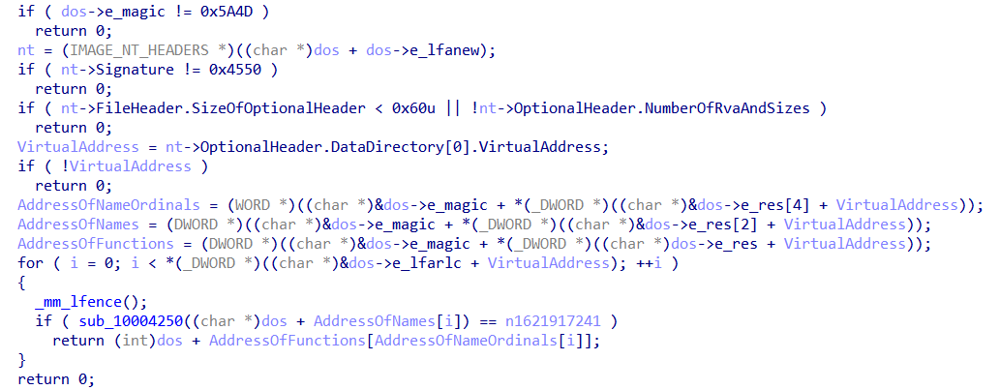

在分析 **TONESHELL** 家族的樣本時，發現它大量利用了 **PEB Walk** 這個技術來躲避 IAT 的靜態分析，同時也使用了許多混淆技術。然後我在分析這些樣本時，常常會忘記一些結構的 offset 或是其他細節，每次都要重新找資料有點累 (´;ω;`)。所以我就趁這個機會，把我從 TONESHELL 身上學到 PEB walk 的程式結構，還有分析的方式，綜合寫成這篇筆記。

## What is PEB Walk

**PEB（rocess Environment Block） Walk** 是一種手動解析 Windows API 的一種方法。它的核心概念是去**解析**程式在執行中**載入的模組（module）**，從他的 **Export Table** 找到匯出的函式地址。在進入 PEB Walk 技巧的說明前，務必確保對於 PE format 有基礎的認識，不然可能會不知道自己在幹嘛。可以參考這一系列文章 [A dive into the PE file format](https://0xrick.github.io/win-internals/pe1/) 來補足有關 PE format 的知識。

> 在 Windows 作業系統中，模組（module）是指一段已載入記憶體的執行單元，通常是：
>
> - 可執行檔（.exe）
> - 動態連結程式庫（.dll）
> - 驅動程式（.sys）
>
> 或其他以 PE（Portable Executable）格式編譯的檔案

## Start with TEB/PEB

**[TEB（Thread Environment Block）](https://en.wikipedia.org/wiki/Win32_Thread_Information_Block)** 上記錄有關 Thread 的資訊，是協助 Windows 用來管理程式執行的一個結構體。在微軟的 [文件](https://learn.microsoft.com/zh-tw/windows/win32/api/winternl/ns-winternl-teb)（aka MSDN, Microsoft Development Network） 中你會看到很多欄位都沒有明確寫出來（壞微軟 x），但你可以從其他地方找到人家逆向工程得到的結論，大致上可以找到這些：

- [NtDoc](https://ntdoc.m417z.com/teb)
- [The Undocumented Functions](http://undocumented.ntinternals.net/index.html?page=UserMode%2FUndocumented%20Functions%2FNT%20Objects%2FThread%2FTEB.html)
- [NirSoft](https://www.nirsoft.net/kernel_struct/vista/TEB.html)
- [ProcessHacker](https://processhacker.sourceforge.io/doc/struct___t_e_b.html)

可以看一下官方給的 TEB 結構：

```c
typedef struct _TEB {
  PVOID Reserved1[12];
  PPEB  ProcessEnvironmentBlock; // <- PEB 在這！
  PVOID Reserved2[399];
  BYTE  Reserved3[1952];
  PVOID TlsSlots[64];
  BYTE  Reserved4[8];
  PVOID Reserved5[26];
  PVOID ReservedForOle;
  PVOID Reserved6[4];
  PVOID TlsExpansionSlots;
} TEB, *PTEB;
```

在 x86 和 x64 的架構中，我們可以分別從 FS、GS 這兩個 Segment Register 中取得指向 TEB 的指標。

```c
#ifdef _WIN64
    // 64-bit: TEB 位於 GS:[0x30]
    PTEB teb =  (PTEB)__readgsqword(0x30);
#else
    // 32-bit: TEB 位於 FS:[0x18]
    PTEB teb = (PTEB)__readfsdword(0x18);
#endif
```

或是使用微軟提供的 API，但其實微軟也只是把上面的程式碼再封裝過而已，所以差異不大。

```c
PTEB teb = GetCurrentTeb();
```

取得 TEB 結構後，我們就可以使用 TEB 找到 PEB（offset 0x30）。

```c
PPEB peb = teb->ProcessEnvironmentBlock;
```

**[PEB（Process Environment Block）](https://en.wikipedia.org/wiki/Process_Environment_Block)** 是 Windows 用來儲存有關 process 資訊的結構體。

而我們關心的是其中的 `PPEB_LDR_DATA Ldr;`（loader data，x86 offset 0x0C / x64 offset 0x18），他利用了雙向鏈結串列來記錄所有載入的模組。

```c
typedef struct _PEB_LDR_DATA
{                                               // x86  / x64
    ULONG Length;                               // 0x00
    BOOLEAN Initialized;                        // 0x04
    HANDLE SsHandle;                            // 0x08
    LIST_ENTRY InLoadOrderModuleList;           // 0x0C / 0x10
    LIST_ENTRY InMemoryOrderModuleList;         // 0x14 / 0x20
    LIST_ENTRY InInitializationOrderModuleList; // 0x1C / 0x30
    // ...
} PEB_LDR_DATA, *PPEB_LDR_DATA;

typedef struct _LIST_ENTRY {                    // x86  / x64
  struct _LIST_ENTRY *Flink; // aka. next       // 0x00
  struct _LIST_ENTRY *Blink; // aka. prev       // 0x04 / 0x08
} LIST_ENTRY, *PLIST_ENTRY, PRLIST_ENTRY;       // 0x08 / 0x10
```

而被串起來的模組會用 `LDR_DATA_TABLE_ENTRY` 來儲存誰串誰。裡面還有 `FullDllName` 欄位可以用於尋找對應的模組，再透過 `DllBase` 指向的 PE header，就可以順藤摸瓜找到 export table 了。

```c
typedef struct _LDR_DATA_TABLE_ENTRY
{                                               // x86  / x64
    LIST_ENTRY InLoadOrderLinks;                // 0x00 / 0x00
    LIST_ENTRY InMemoryOrderLinks;              // 0x08 / 0x10
    LIST_ENTRY InInitializationOrderLinks;      // 0x10 / 0x20
    PVOID DllBase;                              // 0x18 / 0x30
    PLDR_INIT_ROUTINE EntryPoint;               // 0x1C / 0x38
    ULONG SizeOfImage;                          // 0x20 / 0x40
    UNICODE_STRING FullDllName;                 // 0x24 / 0x48
    UNICODE_STRING BaseDllName;                 // 0x2C / 0x58
    // ...
} LDR_DATA_TABLE_ENTRY, *PLDR_DATA_TABLE_ENTRY;
```

到這邊我們小總結一下：

- TEB 裡面儲存了很多與執行續有關的資訊，其中包含了 PEB。
- PEB 裡面儲存了很多與行程有關的資訊，其中包含了 `Ldr`，儲存了載入模組的雙向鏈結串列。
- `ldr->InLoadOrderModuleList` 的節點是 `LDR_DATA_TABLE_ENTRY`
- 在 `LDR_DATA_TABLE_ENTRY` 中
  - 有 `DllBase` 指向模組的 PE header
  - 還有 `FullDllName` 可以提供我們尋找目標模組（ex. ntdll.dll）

<!-- 所以整個的關係圖大概如下： -->

<!-- 要補上圖片說明 -->

## Playing with Doubly Linked List

那我們就可以透過這層關係，來模擬微軟提供的 `FARPROC GetProcAddress(HMODULE hModule, LPCSTR  lpProcName)` 在做的事情。我們只要有 DLL 名稱，就可以透過 `InLoadOrderModuleList` 去找我們要的 DLL。

> DLL（Dynamic-Linked Library，aka. 動態連結函式庫），是作業系統用來節省資源發展出的一套；使用共用函式酷的方式。而我們可以使用 `HMODULE LoadLibrary(LPCSTR lpLibFileName)` 來拿到該 DLL 的句炳（handle）。在 Windows 中，句炳（handle）通常是指操作一個資源的 id，作業系統會去操作 id 對應到的資源。但 `HMODULE` 恰巧會是該模組的記憶體位址。

我們可以先實作一個函式，回傳模組的 `DllBase`。

```c
PTEB get_teb() {
    #ifdef _WIN64
    // 64-bit: TEB 位於 GS:[0x30]
    return (PTEB)__readgsqword(0x30);
#else
    // 32-bit: TEB 位於 FS:[0x18]
    return (PTEB)__readfsdword(0x18);
#endif
}

PVOID peb_walk(PWSTR DllName) {
    PPEB peb = get_teb()->ProcessEnvironmentBlock;

    LIST_ENTRY *head = &peb->Ldr->InMemoryOrderModuleList;
    LIST_ENTRY *curr = head->Flink;

    for(; curr != head; curr = curr->Flink) {
        LDR_DATA_TABLE_ENTRY *entry = CONTAINING_RECORD(curr, LDR_DATA_TABLE_ENTRY, InMemoryOrderLinks);

        wchar_t *dll_name = wcsrchr(entry->FullDllName.Buffer, L'\\') + 1;

        if(_wcsicmp(dll_name, DllName) == 0) {
            // printf("[+] DllBase: 0x%p\n", entry->DllBase);
            return entry->DllBase;
        }
    }
    return INVALID_HANDLE_VALUE;
}
```

## PE Format and Export Table

怕大家忘記，我們可以再重新複習一下 PE format，因為上面真的太多資訊了。**PE（Portable Executable，aka. 可移植性可執行文件**，是 Windows 拿來做為與可執行檔相關的檔案儲存格式。維基百科上說包含這些副檔名：`.acm`, `.ax`, `.cpl`, `.dll`, `.drv`, `.efi`, `.exe`, `.mui`, `.ocx`, `.scr`, `.sys`, `.tsp`。

PE format 大致上可以分成六個區塊：

- DOS Header
- DOS stub
- Rish Header
- NT Header
- Section Table
- Sections

如果用 PE Bear 分析 ntdll.dll 就會看到以下結構：



我們可以用 DOS Header 找到 NT Header 的位址，結構中的 `e_lfanew`（offset 0x3C） 會是 NT Header 的 RVA（Relative Virtual Address）。很有趣的是在 PE format 中的很多欄位，都是用 rva 表示，也就是說如果要取得那個資源，就要再加上 `DllBase` 才會是該資源的指標。

這個是 `winnt.h` 中定義的 `IMAGE_DOS_HEADER`：

```c
typedef struct _IMAGE_DOS_HEADER {      // DOS .EXE header
    WORD   e_magic;                     // Magic number
    WORD   e_cblp;                      // Bytes on last page of file
    WORD   e_cp;                        // Pages in file
    WORD   e_crlc;                      // Relocations
    WORD   e_cparhdr;                   // Size of header in paragraphs
    WORD   e_minalloc;                  // Minimum extra paragraphs needed
    WORD   e_maxalloc;                  // Maximum extra paragraphs needed
    WORD   e_ss;                        // Initial (relative) SS value
    WORD   e_sp;                        // Initial SP value
    WORD   e_csum;                      // Checksum
    WORD   e_ip;                        // Initial IP value
    WORD   e_cs;                        // Initial (relative) CS value
    WORD   e_lfarlc;                    // File address of relocation table
    WORD   e_ovno;                      // Overlay number
    WORD   e_res[4];                    // Reserved words
    WORD   e_oemid;                     // OEM identifier (for e_oeminfo)
    WORD   e_oeminfo;                   // OEM information; e_oemid specific
    WORD   e_res2[10];                  // Reserved words
    LONG   e_lfanew;                    // File address of new exe header
  } IMAGE_DOS_HEADER, *PIMAGE_DOS_HEADER;
```

接著我們就可以用 NT Header 找到 Optional Header（offset 0x18），可以看到在 `winnt.h` 定義了 32-bits 和 64-bits 兩個版本的 NT Header，就只差在 Optional Header。

```c
typedef struct _IMAGE_NT_HEADERS64 {
    DWORD Signature;
    IMAGE_FILE_HEADER FileHeader;
    IMAGE_OPTIONAL_HEADER64 OptionalHeader; // <- 在這！
} IMAGE_NT_HEADERS64, *PIMAGE_NT_HEADERS64;

typedef struct _IMAGE_NT_HEADERS {
    DWORD Signature;
    IMAGE_FILE_HEADER FileHeader;
    IMAGE_OPTIONAL_HEADER32 OptionalHeader; // <- 在這！
} IMAGE_NT_HEADERS32, *PIMAGE_NT_HEADERS32;
```

Optional Header 裡面記錄了三種類型的資訊：

- **標準欄位**：這些欄位主要描述執行檔的基本載入行為。
- **Kernel 特定欄位**：描述執行時記憶體配置、堆疊、作業系統需求等。
- **匯入與匯出資訊**： 匯入與匯出資訊。

> GPT 幫我整理的差異表格

| 差異成員             | x86 (`IMAGE_OPTIONAL_HEADER32`) | x64 (`IMAGE_OPTIONAL_HEADER64`)   |
| -------------------- | ------------------------------- | --------------------------------- |
| `Magic`              | `0x10B`                         | `0x20B`（這是判斷架構的關鍵欄位） |
| `BaseOfData`         | ✅ 有                           | ❌ **x64 沒有此欄位**             |
| `ImageBase`          | `DWORD`（4 bytes）              | `ULONGLONG`（8 bytes）            |
| `SizeOfStackReserve` | `DWORD`（4 bytes）              | `ULONGLONG`（8 bytes）            |
| `SizeOfStackCommit`  | `DWORD`                         | `ULONGLONG`                       |
| `SizeOfHeapReserve`  | `DWORD`                         | `ULONGLONG`                       |
| `SizeOfHeapCommit`   | `DWORD`                         | `ULONGLONG`                       |

其中匯入與匯出資訊是由一個陣列儲存：

```c
IMAGE_DATA_DIRECTORY DataDirectory[IMAGE_NUMBEROF_DIRECTORY_ENTRIES];
```

這個陣列最多紀錄 16 筆資料，每個索引的用途也被定義在 `winnt.h` 裡面，我們會想要從 Export Directory 中去找模組匯出的函式地址：

```c
// Directory Entries

#define IMAGE_DIRECTORY_ENTRY_EXPORT          0   // Export Directory
#define IMAGE_DIRECTORY_ENTRY_IMPORT          1   // Import Directory
#define IMAGE_DIRECTORY_ENTRY_RESOURCE        2   // Resource Directory
#define IMAGE_DIRECTORY_ENTRY_EXCEPTION       3   // Exception Directory
#define IMAGE_DIRECTORY_ENTRY_SECURITY        4   // Security Directory
#define IMAGE_DIRECTORY_ENTRY_BASERELOC       5   // Base Relocation Table
#define IMAGE_DIRECTORY_ENTRY_DEBUG           6   // Debug Directory
//      IMAGE_DIRECTORY_ENTRY_COPYRIGHT       7   // (X86 usage)
#define IMAGE_DIRECTORY_ENTRY_ARCHITECTURE    7   // Architecture Specific Data
#define IMAGE_DIRECTORY_ENTRY_GLOBALPTR       8   // RVA of GP
#define IMAGE_DIRECTORY_ENTRY_TLS             9   // TLS Directory
#define IMAGE_DIRECTORY_ENTRY_LOAD_CONFIG    10   // Load Configuration Directory
#define IMAGE_DIRECTORY_ENTRY_BOUND_IMPORT   11   // Bound Import Directory in headers
#define IMAGE_DIRECTORY_ENTRY_IAT            12   // Import Address Table
#define IMAGE_DIRECTORY_ENTRY_DELAY_IMPORT   13   // Delay Load Import Descriptors
#define IMAGE_DIRECTORY_ENTRY_COM_DESCRIPTOR 14   // COM Runtime descriptor
```

`DataDirectory[IMAGE_DIRECTORY_ENTRY_EXPORT]` 會儲存 `IMAGE_EXPORT_DIRECTORY` 結構的資訊。所以接著我們要來看，怎麼樣才可以從 `IMAGE_EXPORT_DIRECTORY` 拿到匯出函式的地址。我們主要會看最後 5 個欄位：

- NumberOfFunctions：所有函式的數量
- NumberOfNames：有名字的函式數量
- AddressOfFunctions：一個 DWORD 的陣列
- AddressOfNames：一個 DWORD 的陣列，函式名稱的 RVA
- AddressOfNameOrdinals：一個 WORD 的陣列，名稱對應的序號

```c
typedef struct _IMAGE_EXPORT_DIRECTORY {    // x86  / x64
    DWORD   Characteristics;                // 0x00
    DWORD   TimeDateStamp;                  // 0x04
    WORD    MajorVersion;                   // 0x08
    WORD    MinorVersion;                   // 0x0A
    DWORD   Name;                           // 0x0C
    DWORD   Base;                           // 0x10
    DWORD   NumberOfFunctions;              // 0x14
    DWORD   NumberOfNames;                  // 0x18
    DWORD   AddressOfFunctions;             // 0x1C         // RVA from base of image
    DWORD   AddressOfNames;                 // 0x20         // RVA from base of image
    DWORD   AddressOfNameOrdinals;          // 0x24         // RVA from base of image
} IMAGE_EXPORT_DIRECTORY, *PIMAGE_EXPORT_DIRECTORY;
```

每一個在 `NumberOfNames` 陣列中的函式名稱，會透過公用索引對應到 `AddressOfNameOrdinals` 裡面的一個 ordinal。然後要再透過這個 ordinal 做為索引，去 `AddressOfFunctions` 陣列中找對應函式的 RVA。

我們尋找目標函式地址的流程如下：

- 找到對應函式名稱的索引 `index`
- 用 `AddressOfNameOrdinals[index]` 取得 `ordinal`
- 用 `AddressOfFunctions[ordinal]` 取得函式 RVA

寫成函式的話就會長這樣：

```c
PVOID get_proc_addr(PVOID DllBase, char *FuncName) {
    IMAGE_DOS_HEADER *dos_hdr = (IMAGE_DOS_HEADER*) DllBase;

#ifdef _WIN64
        PIMAGE_NT_HEADERS64 nt_header = (PIMAGE_NT_HEADERS64)((BYTE *)DllBase + dos_hdr->e_lfanew);
#else
        PIMAGE_NT_HEADERS32 nt_header = (PIMAGE_NT_HEADERS32)((BYTE *)DllBase + dos_hdr->e_lfanew);
#endif

    DWORD exp_dir_rva = nt_header->OptionalHeader.DataDirectory[IMAGE_DIRECTORY_ENTRY_EXPORT].VirtualAddress;

    IMAGE_EXPORT_DIRECTORY *exp_dir = (IMAGE_EXPORT_DIRECTORY*)((BYTE *)DllBase + exp_dir_rva);

    DWORD *functions    = (DWORD*)((BYTE*)DllBase + exp_dir->AddressOfFunctions);
    DWORD *names        = (DWORD*)((BYTE*)DllBase + exp_dir->AddressOfNames);
    WORD  *ordinals     = (WORD*) ((BYTE*)DllBase + exp_dir->AddressOfNameOrdinals);

    int index = 0;
    for(; index < exp_dir->NumberOfNames; index++) {
        char* name = (char*)DllBase + names[index];
        if(stricmp(FuncName, name) == 0)
            return (BYTE*)DllBase + functions[ordinals[index]];
    }

    return NULL;
}
```

接著再寫點程式就可以收動召喚出 MessageBox 了：

```c
typedef int (WINAPI *MessageBoxA_t)(HWND hWnd, LPCSTR lpText, LPCSTR lpCaption, UINT uType);

int main(int argc, char *argv[]) {
    PVOID hModule = peb_walk(L"ntdll.dll");
    printf("[i] ntdll.dll DllBase: 0x%p\n", hModule);

    hModule = LoadLibraryA("User32.dll");
    MessageBoxA_t msgboxa = get_proc_addr(hModule, "MessageBoxA");
    printf("[i] MessageBoxA addr: %p\n", (void*)msgboxa);

    msgboxa(NULL, "Hello", "Hello", MB_OK);

    return EXIT_SUCCESS;
}
```


偷偷丟上 [VirusTotal](https://www.virustotal.com/gui/file/a8e9fd03070a40295ca0171fb0a48dba2c3e14ba0794444e8a5624e089992af3/detection)，蠻有趣的有兩家判定為病毒。

## Analysist Perspective

如果沒有好好的定義結構指標類型，就會看到一系列混亂的指標操作。所以正確識別出結構體的指標操作很重要，尤其 offset 通常是最重要判斷的標準之一。先從簡單的開始，這是從 32-bit 的 TONESHELL 樣本中擷取的片段，是用來取得 Ldr 的程式結構：



可以推算出 `v13` 是 PEB，PEB + 12 是 `Ldr`，`Ldr` + 20 是 `InMemoryOrderModuleList`，所以 `v12` 就是這個鏈結串列的 `head`。`v12` 解參考就是 `head->Flink`，所以可以推測會用 `v11` 來走訪雙向鏈結串列，可以叫它 `curr`。然後這邊會有個小陷阱，還記得我們前面提過，這個鏈結串列的節點的型別是 `LDR_DATA_TABLE_ENTRY `，所以 `curr` 的型別要設定成 `LDR_DATA_TABLE_ENTRY *`。

到這裡原本醜醜的反組譯：


就會變成讓人比較可以接受的型式，丟給 GPT 分析也比較準確（ｘ


然後可以看到中間有一個 `v8 = sub_1000D400(Flink, n1621917241);` 看起來很熟悉，把 `Flink` 丟進去，然後有一些字串比對後會 return `v8`。`v8` 就可以推測是目標的函式地址。只不過 `Flink` 應該要是 `DllBase` 而不是 `InInitializationOrderLinks`，偏移量差了一點，有點怪怪的可以先忽略它。

追進去看可以看到以下程式片段，`a1` 和 `n1621917241` 是依序傳遞進來的參數，可以推測 `n1621917241` 是函式名稱經過雜湊得到的整數：



神秘數字 23117 和 17744 換成數字後分別是 `0x4A5D` 和 `0x4550`，這是 DOS Header 和 NT Header 的 magic，從這點就可以修正剛剛丟進來的 Flink 型別問題。所以 `a1` 和 `v8` 就可以分別命名成 `dos` 和 `nt`，並更改指標型別。這時候大概就可以看出結構了：



雖然中間的 `AddressOfxxx` 在反編譯時出了點問題，但還可以看出大概是誰，再將三個陣列的型別定義正確後，就可以看到一個相對乾淨的程式碼。在最後也可以看到他回傳 `dos + AddressOfFunctions[...]` 就是前面我們寫過函式地址的取得方式。

## Summary

PEB walk 是惡意軟體躲避 EDR 靜態分析或偵測常見的方式之一，尤其在 TONESHELL Family 中更是廣泛的被使用。分析人員只要熟悉取得各個資訊的流程和程式結構，並在 IDA 中正**確定義結構型別**，便可以加速分析速度。

- 取得 `TEB` -> `PEB` -> `Ldr`
- 比對 `LDR_DATA_TABLE_ENTRY` 結構中的 `FullDllName.Buffer`，並取得目標的 `DllBase`
- 透過 DOS Header 取得 NT Header，並找出 Optional Header 中的 Export Directory
- 使用 `AddressOfFunctions`、`AddressOfNames` 和 `AddressOfNameOrdinals` 找到目標函式的位址

寫完這篇文章我又更熟悉 PEB walk 了 (\*‘ v`\*)

## Reference

- [【Day 07】歡迎來到實力至上主義的 Shellcode (上) - Windows x86 Shellcode ](https://ithelp.ithome.com.tw/articles/10269530)
- [【Day 08】歡迎來到實力至上主義的 Shellcode (下) - Windows x86 Shellcode](https://ithelp.ithome.com.tw/articles/10270253)
- [Understanding the Process Environment Block (PEB) for Malware Analysis](https://metehan-bulut.medium.com/understanding-the-process-environment-block-peb-for-malware-analysis-26315453793f)
- [vs-obfuscation](https://github.com/Tai7sy/vs-obfuscation/tree/master)
